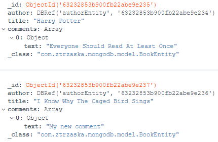

# Mongo noSQL embedded database with REST API

### Get started

This project demonstrates sample spring boot microservice, which use noSQL embedded mongo database. 

On start-up the system saves few entities to database. Objects are stored as whole json documents and by using entity relationships with DBRef annotation.
Project facilitates REST API with swagger tool to ease invoke endpoints.

### Swagger

```
http://localhost:8080/swagger-ui/
```

### Database connection details and initial data

There is no authorization needed

```
mongodb://localhost:27017
```

Inital data loaded on start-up



### Spring boot configuration

```
spring.data.mongodb.port=27017
spring.data.mongodb.database=embedded
```


### Docker
```
docker build -t mongodb-java .
docker run -dp 8080:8080 mongodb-java
```

### Reference Documentation

For further reference, please consider the following sections:

* [Mongodb documentation](https://www.mongodb.com/docs/)
* [Spring Data MongoDB](https://docs.spring.io/spring-boot/docs/2.7.3/reference/htmlsingle/#data.nosql.mongodb)
* [Embedded MongoDB Database](https://docs.spring.io/spring-boot/docs/2.7.3/reference/htmlsingle/#data.nosql.mongodb.embedded)
* [Spring Boot Maven Plugin Reference Guide](https://docs.spring.io/spring-boot/docs/2.7.3/maven-plugin/reference/html/)
* [Create an OCI image](https://docs.spring.io/spring-boot/docs/2.7.3/maven-plugin/reference/html/#build-image)
* [Spring Web](https://docs.spring.io/spring-boot/docs/2.7.3/reference/htmlsingle/#web)

### Guides

The following guides illustrate how to use some features concretely:

* [Accessing Data with MongoDB](https://spring.io/guides/gs/accessing-data-mongodb/)

